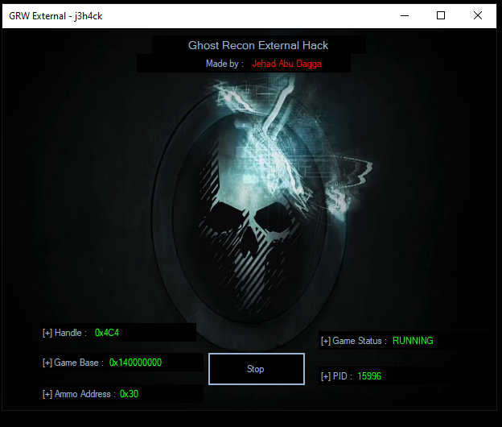

# Ghost Recon External Hack

[!] for educational perposes only !!!


## Description
Welcome to my Ghost Recon External Hack project! This is a simple C++  hack I created to explore GUI Windows Forms using c++ and game hacking. It was an exciting journey, and I learned a lot through the process. This hack showcases various techniques and methods used to modify and exploit game mechanics.


## Usage
To use this hack, follow these steps:
1. Clone the repository:
```
git clone https://github.com/j3h4ck/GhostReconExternalHack.git
cd GhostReconExternalHack
```
2. Compile the source code (if applicable):

3. Open the project in your preferred C# IDE (e.g., Visual Studio).
4. Build the solution to compile the source code.
5. Run the hack.
